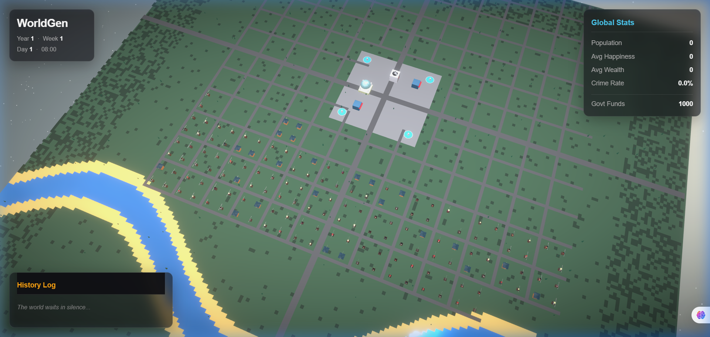

<div align="center">
  

  # Self Growing World 

  **An autonomous, self-growing miniature world simulation powered by AI and React Three Fiber.**

  <p align="center">
    <a href="https://sambhav-gautam.github.io/selfgrowing/">
      
    </a>
    <a href="https://github.com/Sambhav-Gautam/selfgrowing/actions">
      
    </a>
    
    
  </p>
</div>

---

### About 
> *A 3D autonomous miniature world simulation where AI agents live, age, and form complex relationships. Built with React Three Fiber.*

## Features

- **Procedural Infrastructure** 
  Generates a sprawling 200x200 grid featuring winding river systems, dense forests, alongside distinct residential and commercial civic hubs.
  
- **Advanced 3D Architecture** 
  Constructs highly detailed, low-poly 3D models including Hospitals, Government buildings, Parks, and varied housing estates.

- **Social Graph Simulation** 
  AI Agents form complex interpersonal relationships (Friendship, Enmity, Family) and track dynamic needs (Sustenance, Safety, Rest) based on their environment.

- **Render Pipeline** 
  Powered by React Three Fiber incorporating bloom post-processing, soft lighting, and a unified glassmorphism user interface.

- **Persistent Cloud State** 
  The history graph and world state are continually saved to JSON and committed automatically via headless GitHub Actions.

---

## Workspace Setup

1. **Install Dependencies**
   ```bash
   npm install
   ```

2. **Initialize Development Server**
   ```bash
   npm run dev
   ```

3. **Execute Headless Simulation locally**
   ```bash
   npx tsx src/scripts/run-simulation.ts
   ```

---

## CI/CD Infrastructure

The automation pipeline leverages GitHub Actions for continuous deployment and logic tracking:
- `deploy.yml`: Automatically tests, builds, and deploys the Vite application utilizing the GitHub Pages environment.
- `simulate.yml`: Recursively processes the headless simulation in the background context. 
- `ci.yml`: Enforces strict type-checking and Prettier formatting standardizations.

> **Disclaimer: For demonstration strictly**
> This project is a simulation created strictly for educational purposes and internal experimentation. All actors, events, and narratives generated by this software are fictional and algorithmically produced. The creators assume no liability for any usage beyond personal observation.
